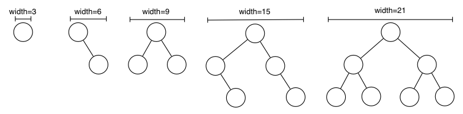

# Week 4 (BST + Revision)

## Height Difference

For each node in the tree print out the difference between the 2 subtrees.

And return the height of the tree.  To not make this question feel nice if it is an empty tree do nothing.

```c
// print the height difference between both left and right subtrees
// for every node in a given binary tree.
int printHeightDiff(BSTree t) {

}
```

## Can we detect if a tree is balanced

?> What makes a balanced tree

```c
#include TREE_IS_NOT_BALANCED (-99)

// Return height of tree if it is balanced else
// return -99 is it is not balanced
int isHeightBalanced(BSTree t) {

}
```

## Computing the width of a tree

- If the tree is empty it has width 0
- A tree with a single node has width of 3
- All other trees have width which is 3 more than the sum of the width of their children

?> Kind of a useless question since its not really always correct but eh still along the same idea as the rest.

```c
int width(BSTree t) {
}
```



## GDB + Valgrind :O

[here](gdb_valgrind)

