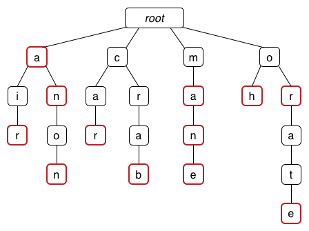

# Week 10

## Interview Question

There really isn't any coding to this you would just describe what you would code and maybe write a little.

Our national retail client has a 200-store branch network, they want to do a big promotion give-away. To participate, customers must enter their email address with a unique code (which is printed on their dockets) into OUR website. No store has more than 10,000 customers/day.

The code must be no more than 9 characters long, and we have to be able to get the following information out:
-	Which store does the code belong to?
-	Which date was the code issued?
-	Which customer (transaction) did the docket belong to (a number starting again at 1 every day)

Consider how easy it is for the end users to read/copy the code into the website and how we can prevent cheaters.

> There are dozens of questions left unanswered but that's the point.  You are meant to understand what kind of assumptions that would need to take for a solution and compare multiple solutions and the required assumptions.

## Assignment Questions?

Are there any questions for the assignment?

## Back to the tute



> The red nodes are 'finishing' nodes.

What are the keys?

Insert the following into a trie

`jaws boots axe boo so sore boot boon`

Does the order matter?

## Boyer Moore Algorithm

Build the last-occurence function (L) for all the characters in the following pattern

`xywapaswyy`

> Let's have a look at the code in C, we just don't have time to code it in 'realtime'

Next for the given sequence identify the sequence of character comparisons (and total number) needed for the Boyer-Moore.

`ABCACBBDABCADD` with pattern `ABCAD`

## Knuth Morris Pratt Algorithm

Failure function(j) is defined as the size of the largest prefix of the pattern from 0 to j such that it is also a suffix of P from 1 to j

`atat`

I'll do the first few...

| j    | 0 | 1 | 2 | 3 |
|------|---|---|---|---|
| P(j) | a | t | a | t |
| F(j) |   |   |   |   |

- F(0) has to be 0 since the region of P[1..0] is not defined
- F(1) is going to be 0 as well since there is no prefix over P[0..1] such that it is also a suffix of P[1..1] i.e. a != t
  - If we had `aa` then F(1) would be 1 since the prefix is 'a' and the suffix is 'a'
- F(2) is going to be 1 also since there is a prefix of length one over P[0..2] ('a') that is also the suffix of P[1..2] ('a')
  - i.e. the first and last character over the region P[0..2] match!
- F(3) is going to be 2 since there is a prefix of length two over P[0..3] ('at') that is also the sufffix of P[1..3] ('at')
  - i.e. the first 2 characters match the last 2
  
Do it now for a longer example;

`cgtacgttcgtac`

What is the failure function.

Next let's do a step by step for text `aaabaadaabaaa` and pattern `aabaaa`

## Huffman Tree!

First off we need a frequency table.  Basically it's an array of how many times each character occurs.

What is the frequency table of `ababbcdcbaabcacbbbs`?

Let's then draw the resulting huffman tree (begin by building a Priority Queue).

And lastly what is the code table of above (0 => left, 1 => right).

Effectively the psuedocode is

```c
freq = generateFrequencies(text)
pq = newPriorityQueue()

for each c in alphabet:
    if freq[c] > 0 then pq = (c, freq[c])

while len(pq) > 2:
    // with dequeue taking the minimum
    first = dequeue(pq)
    second = dequeue(pq)
    t = newTreeNode()
    t.key = first.key + second.key
    // the order doesn't really matter
    // it will change your huffman code table (a bit)
    // but that doesn't matter
    t.left = first
    t.right = second
    enqueue(pq, t)
```

